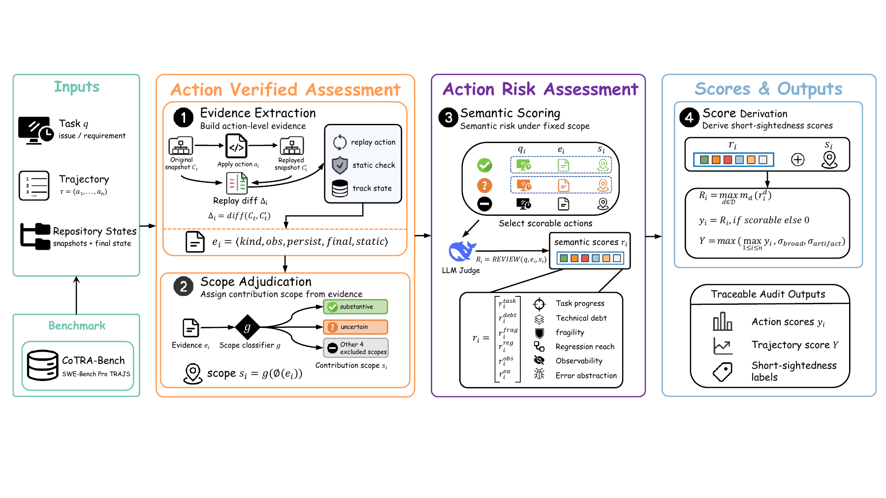

# CoTRA: Contribution-Tracked Risk Auditing

**Paper:** CoTRA: Contribution-Tracked Risk Auditing for the Trajectories of LLM Coding Agents



Reference implementation of **CoTRA**, a framework for auditing the trajectories
of LLM coding agents. Instead of an opaque holistic judgment, CoTRA grounds every
score in repository evidence — replayed edits, affected code regions, and whether
each edit remains in the final code — and separates **action validity assessment**
(does the edit really contribute?) from **action risk assessment** (how risky is it?).

CoTRA has four sequential modules:

1. **Evidence extraction** — replay each edit on repository snapshots; build a
   per-action evidence record `e_i = ⟨kind, obs, persist, final, static⟩`.
2. **Scope adjudication** — a shallow decision tree assigns each action a
   contribution scope `s_i` from the evidence; only scorable scopes pass through.
3. **Semantic scoring** — one LLM call per scorable action scores predefined
   risk dimensions, taking the fixed scope as a premise.
4. **Score derivation** — fixed formulas combine the factual and semantic
   outputs into action-level (`y_i`) and trajectory-level (`Y`) short-sightedness.

The companion benchmark is **CoTRA-Bench**: 100 long-horizon SWE-bench Pro
trajectories with 4,303 human-annotated action labels across four agent families
(GPT, Claude, Gemini, GLM).

> The internal Python package is named `encoder_judge`; it is the CoTRA pipeline.
> See [`docs/method_to_code.md`](docs/method_to_code.md) for the full
> paper-section → code mapping.

## Install

```bash
pip install -r requirements.txt        # openai, scikit-learn
# or: pip install -e .
```

Python ≥ 3.11. All scripts expect `PYTHONPATH=src`.

## Configure the judge

CoTRA uses an OpenAI-compatible chat API (the paper uses DeepSeek-V4-pro at
temperature 0). **Never commit your API key.**

```bash
cp config/llm_config.example.py llm_config.local.py   # git-ignored
# edit llm_config.local.py and set LLM_API_KEY
# (or export LLM_API_KEY / LLM_BASE_URL / LLM_JUDGE_MODEL in the environment)
```

`llm_config.py` holds non-secret defaults; `llm_config.local.py` overrides it;
environment variables override both (see `src/llm_judge/config.py`).

## Data

CoTRA-Bench is provided separately and is not bundled here. Point `DATA_ROOT`
at your copy; the expected layout and label schema are documented in
[`docs/data_format.md`](docs/data_format.md), and the human annotation protocol
in [`docs/annotation_protocol.md`](docs/annotation_protocol.md).

```
data/CoTRA-Bench/{set1_v2,set2_v2_batch03,set3_v2}/<instance>/<model>.*.json
```

## Reproduce

```bash
export DATA_ROOT=data/CoTRA-Bench
export REPO_CACHE=.repo_cache          # replay snapshot cache

# Main CoTRA run (cross-fitted, frozen scope) + zero-token ablation
bash scripts/run_crossfit.sh

# Baselines B1 (Evidence+rules) and B3 (Evidence+LLM, no gate)
bash scripts/run_baselines.sh

# Baseline B4 (end-to-end judge); needs llm_config.e2e.py
cp config/llm_config.e2e.example.py llm_config.e2e.py   # edit key
bash scripts/run_e2e.sh

# Headline numbers: scope kappa, bootstrap CIs, per-family, token usage
python scripts/reproduce_tables.py \
    --data-root "$DATA_ROOT" --outputs-root outputs/encoder_judge
```

For a single method/run, `scripts/eval_predictions.py` writes a full
prediction-vs-gold report (scope kappa, exact agreement, per-dimension Spearman,
trajectory metrics, cost summary).

## Repository layout

```
src/encoder_judge/     CoTRA pipeline (the four modules + CLI + baselines)
src/repo_env/          edit replay on repository snapshots
src/static_analysis/   lightweight static signals (syntax, lint, artifacts, ...)
src/llm_judge/         API client, cache, cost accounting, score derivation
src/core/              shared action / risk-vector / snapshot types
scripts/               run + evaluation scripts
docs/                  method-to-code map, data format, annotation protocol
baselines/             baseline notes (B2 ProcCtrlBench is external)
config/                example LLM configs (copy to git-ignored local files)
```

## License

Released under the MIT License (see [`LICENSE`](LICENSE)). Update the copyright
holder before release.
